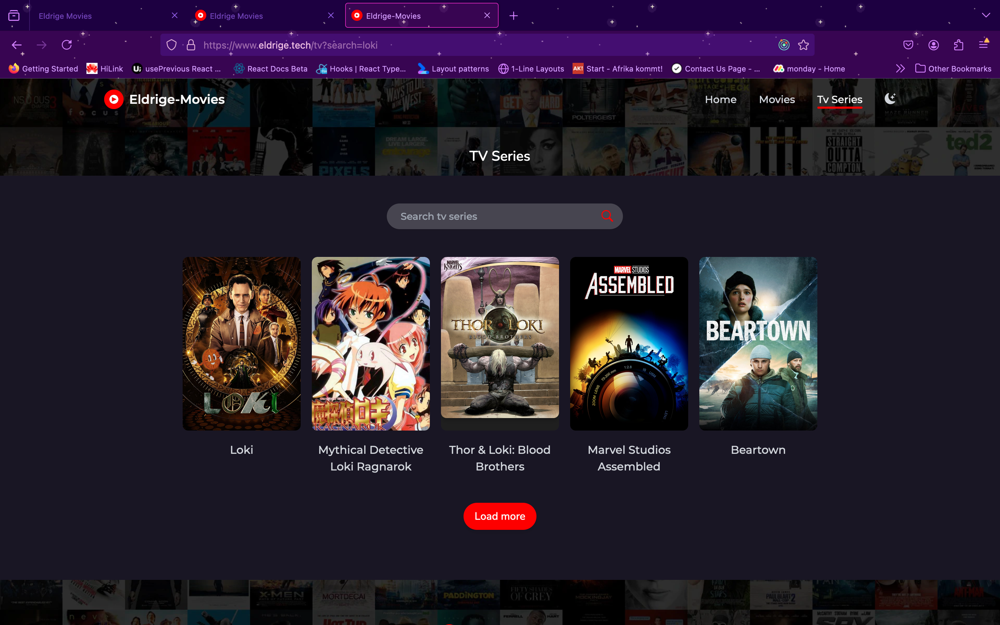

# ELdrigeMovies 🎬

ELdrigeMovies is a sleek and user-friendly platform that allows users to explore their favorite movies and TV shows. Powered by **React** and **Redux Toolkit**, the app integrates with **The Movie Database (TMDb)** to provide comprehensive movie details, trailers, and more.

---

## Screenshots 📸

### Home Page


### Movie Details Page


### Search View



---

## Live Website 🌐

Check out the live version of the app here: [Eldrige Movies](https://www.eldrige.tech/)

---

## DemoVideo 🎥

Check out the demo video of the app here: [Eldrige movies demo)](https://jam.dev/c/0b07f683-aab9-45a8-8374-68335153b9cd)

## Features ✨

- **Search** for movies and TV shows effortlessly.
- **View Details** including cast, synopsis, and ratings.
- **Watch Trailers** directly from the app.
- Responsive design for seamless experience across devices.

---

## Technologies Used 🛠️

- **Frontend**: React
- **State Management**: Redux Toolkit
- **API**: TMDb API
- **Deployment**: Docker, GitHub Actions, Nginx, Node.js
- **Backend**: Nginx serves the React app in production.

---

## Docker configuration 🏗️

The Dockerfile is composed of node and nginx images. The React app is built and served using Nginx. The Dockerfile is optimized for production deployment.:

---

## Github Actions 🚀

The github actions login to the docker hub and build the docker image and push it to the docker hub. The image is then pulled and deployed to both the web-01 and web-02 servers.

---

## Installation 🏗️

To run the app locally, follow these steps:

Clone the repository:

```bash
Copy code
git clone https://github.com/eldrige/web_infra_summative
cd web_infra_summative
Install dependencies:

bash
Copy code
npm install or yarn
Create a .env file and add your TMDb API key:

makefile
Copy code
REACT_APP_TMDB_API_KEY=your_tmdb_api_key
Start the development server:

bash
Copy code
npm start
Open http://localhost:5173 in your browser to explore the app.
```

---

## Acknoledgements 🙌

- [TMDb API](https://www.themoviedb.org/documentation/api) for providing movie data.
- [React](https://reactjs.org/) and [Redux Toolkit](https://redux-toolkit.js.org/) for powering the frontend.
- [Docker](https://www.docker.com/) and [Nginx](https://nginx.org/) for efficient deployment.
